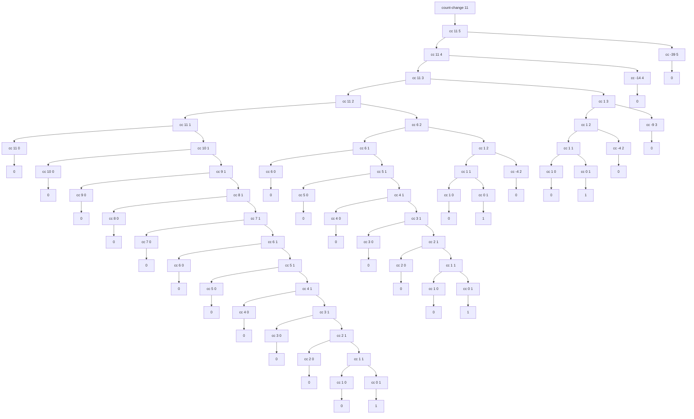

Draw the tree illustrating the process generated by the `count-change` procedure of 1.2.2 in making change for 11 cents. What are the orders of growth of the space and number of steps used by this process as the amount to be changed increases?

We can start by modifying the procedure so that it records each function call to `cc`:

```racket
(define (print-spaces depth)
  (display (make-string (* 2 depth) #\space)))

(define (count-change amount)
  (cc amount 5 0))

(define (cc amount kinds-of-coins depth)
  (print-spaces depth)
  (display "(cc ")
  (display amount)
  (display " ")
  (display kinds-of-coins)
  (display ")")
  (newline)
  (cond ((= amount 0)
         (print-spaces depth)
         (display 1)
         (newline)
         1)
        ((or (< amount 0) 
             (= kinds-of-coins 0))
         (print-spaces depth)
         (display 0)
         (newline)
         0)
        (else 
         (+ (cc amount (- kinds-of-coins 1) (+ 1 depth))
            (cc (- amount (first-denomination 
                           kinds-of-coins))
                kinds-of-coins (+ 1 depth))))))

(define (first-denomination kinds-of-coins)
  (cond ((= kinds-of-coins 1) 1)
        ((= kinds-of-coins 2) 5)
        ((= kinds-of-coins 3) 10)
        ((= kinds-of-coins 4) 25)
        ((= kinds-of-coins 5) 50)))

(count-change 11)
```

This results in the following output:

```racket
(cc 11 5)
  (cc 11 4)
    (cc 11 3)
      (cc 11 2)
        (cc 11 1)
          (cc 11 0)
          0
          (cc 10 1)
            (cc 10 0)
            0
            (cc 9 1)
              (cc 9 0)
              0
              (cc 8 1)
                (cc 8 0)
                0
                (cc 7 1)
                  (cc 7 0)
                  0
                  (cc 6 1)
                    (cc 6 0)
                    0
                    (cc 5 1)
                      (cc 5 0)
                      0
                      (cc 4 1)
                        (cc 4 0)
                        0
                        (cc 3 1)
                          (cc 3 0)
                          0
                          (cc 2 1)
                            (cc 2 0)
                            0
                            (cc 1 1)
                              (cc 1 0)
                              0
                              (cc 0 1)
                              1
        (cc 6 2)
          (cc 6 1)
            (cc 6 0)
            0
            (cc 5 1)
              (cc 5 0)
              0
              (cc 4 1)
                (cc 4 0)
                0
                (cc 3 1)
                  (cc 3 0)
                  0
                  (cc 2 1)
                    (cc 2 0)
                    0
                    (cc 1 1)
                      (cc 1 0)
                      0
                      (cc 0 1)
                      1
          (cc 1 2)
            (cc 1 1)
              (cc 1 0)
              0
              (cc 0 1)
              1
            (cc -4 2)
            0
      (cc 1 3)
        (cc 1 2)
          (cc 1 1)
            (cc 1 0)
            0
            (cc 0 1)
            1
          (cc -4 2)
          0
        (cc -9 3)
        0
    (cc -14 4)
    0
  (cc -39 5)
  0
4
```

This output can also be visualized as a graph:



This graph allows us to see the shape of the process. The space requirements are proportional to the height of the deepest subtree, which is proportional to `amount`. Therefore the order of growth of the space of the process is $$\Theta(amount)$$.
